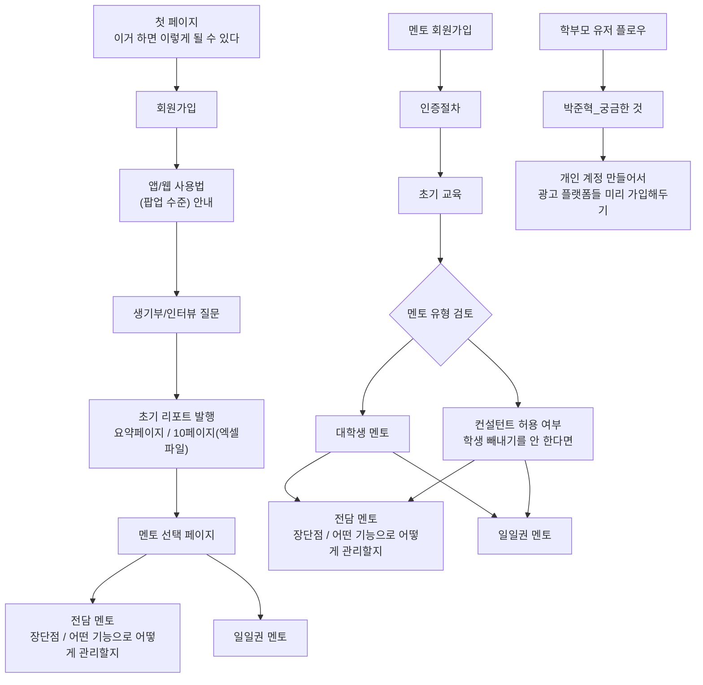

## 🗨️회의 내용

아래 플로우를 다이어그램으로 만들어줘

```mermaid
flowchart TD
  A["첫 페이지<br/>이거 하면 이렇게 될 수 있다"] --> B["회원가입"]
  B --> C["앱/웹 사용법<br/>(팝업 수준) 안내"]
  C --> D["생기부/인터뷰 질문"]
  D --> E["초기 리포트 발행<br/>요약페이지 / 10페이지(엑셀파일)"]
  E --> F["멘토 선택 페이지"]
  F --> G["전담 멘토<br/>장단점 / 어떤 기능으로 어떻게 관리할지"]
  F --> H["일일권 멘토"]

  M1["멘토 회원가입"] --> M2["인증절차"]
  M2 --> M3["초기 교육"]
  M3 --> M4{"멘토 유형 검토"}
  M4 --> M5["대학생 멘토"]
  M4 --> M6["컨설턴트 허용 여부<br/>학생 빼내기를 안 한다면"]
  M5 --> M7["전담 멘토<br/>장단점 / 어떤 기능으로 어떻게 관리할지"]
  M5 --> M8["일일권 멘토"]
  M6 --> M7
  M6 --> M8

  P1["학부모 유저 플로우"] --> P2["박준혁_궁금한 것"]
  P2 --> P3["개인 계정 만들어서<br/>광고 플랫폼들 미리 가입해두기"]
```