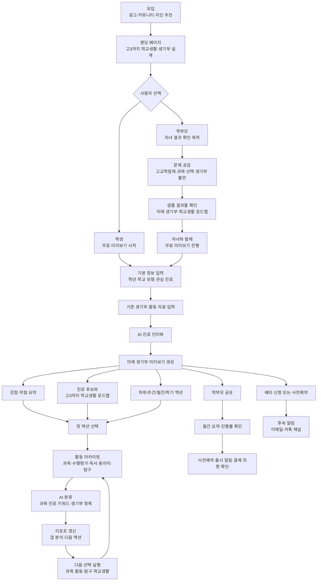

# 전체 유저 플로우 다이어그램

## 핵심 흐름

## 플로우 원칙

- 첫 경험은 회원가입보다 결과물 확인을 우선한다.
- 학생에게는 "지금 학교생활에서 무엇을 선택해야 하는가"를 보여준다.
- 학부모에게는 "우리 아이가 고3까지 어떤 방향으로 가고 있는가"를 요약한다.
- 반복 사용의 중심은 활동 아카이빙과 리포트 갱신이다.

## 출처

- [학생_유저_플로우](02_학생_유저_플로우.md)
- [학부모_유저_플로우](03_학부모_유저_플로우.md)
- [서비스 작동구조](../02_서비스_정의/03_서비스_작동구조.md)
- [플랫폼_차별화_아카이빙](../../03_사업모델_GTM/06_플랫폼_차별화_아카이빙.md)
